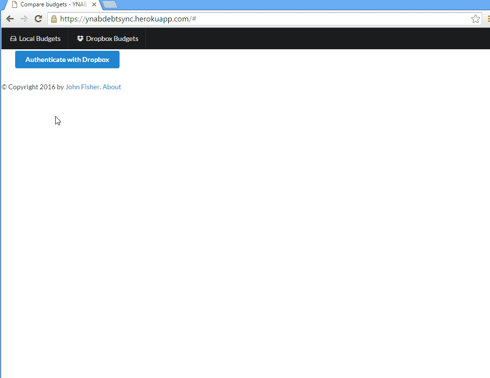

# YNAB Debt Sync ##

YNAB Debt Sync lets you quickly reconcile your shared debt category with another
person. If you track the money you lend to someone with YNAB and they do the
same, this web application automates the process of finding which transactions
are missing from each other’s budget so the totals tally up.

## Dependencies ##

Install the dependencies in a virtualenv:

    $ pip install -r requirements.txt

## Running the development server

From the virtualenv with all dependencies installed:

    $ python run.py

## Running the tests ##

From the project’s root, execute

    $ nosetests
